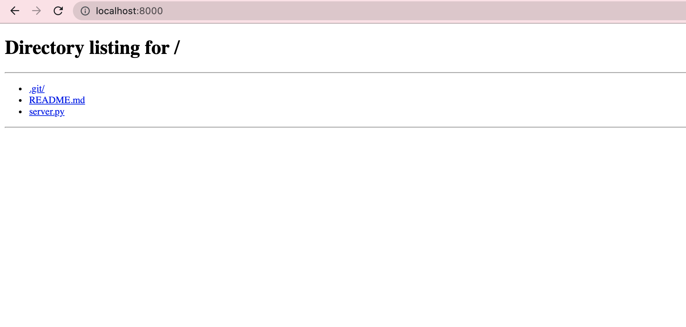

# Backend Hands-on
Created by Tori

## 始める前に
以下のコマンドでPythonが入っているかを確認します。
```
$ python -V  
$ python3 -V 

Python 3.6.5
```

どちらかのコマンドでPythonの3系が出てくれば本ハンズオンを進めることができます。

(コマンドは全て`python`で書きますが、python3で3系が出てくる人は`python3`と適宜読み替えてください。)


もし入っていない場合は、インストールしてください。

## 全体の概要
本ハンズオン終了後、全体でこのような構成になります。


## クライアントサイドとサーバーサイドの通信について
今回はクライアントサイドとサーバーサイドをHTTPで通信をします。今回はRESTful API(=REST API)を実装していきます。REST以外にもGraphQL・gRPC・OpenAPIなど違う通信方式もあるので、興味のある人は調べてみるといいでしょう。
<br>

クライアントサイドとサーバーサイドの通信方法にはGETとPOSTを利用します。

これ以外にもPUTやDELETEなど他の通信方法もあるので興味のある人は調べてみてください。

### GET
> GETは指定したリソースの表現を転送するようにリクエストするメソッドです。
つまり、何か情報を検索したり取得するために使うためのメソッドになります。
>
> 例えば、ブラウザでURLを入力し検索するとき、あなたは無意識にGETメソッドを使っています。
>
> また仕様で安全かつ冪等であると定義されているため、基本的に読み取り専用な機能に対して使うべきメソッドになります。
>
> GETを使うとどのような処理をしていたとしてもクライアントには安全なAPIだと見なされます。
これは、クライアントからはサーバがどのような処理をやっているかを知ることはできないためです。

### POSTは指定したリソースを実装した機能に従って処理をする機能になります。

> 主に登録処理や更新処理などの、書き込みがありリソースが更新される可能性のある処理に対して使うメソッドになります。
> 
> 例えば、以下のような例があります。
> 
> HTMLの `<form></form>`に入力された内容をDBへ登録する
> - ブログの記事を投稿する
> - 新しいユーザを登録する
> - 既存のデータに新しい情報を付加する
> また、GETとは反対に冪等でないかつ安全でないと定義されています。

引用: https://qiita.com/kanataxa/items/522efb74421255f0e0a1


## コマンドでサーバーを立ててみる
まずは、サーバーを立ててみましょう。図で言うとこの部分になります。


以下のコマンドを叩いてみてください。
```
$ python -m http.server 8000
```

起動できたら、http://localhost:8000 または http://127.0.0.1:8000/ を開いてみてください。



このような画面が出ればokです。サーバーを立てることができました。


## Flaskを使ってサーバーサイドを作成してみる
次はコードを書いてサーバーサイドの構築をしてみましょう。

### Flaskのインストール
いずれかのコマンドを使ってインストールしてください。
```
$ pip install flask             # python2対応
$ pip3 install flask            # python3対応
$ python -m pip install flask  # 推奨
$ conda install flask           # anaconda使ってる人向け
```
私は仮想環境上でやっていたので、`conda`でインストールしました。

### 最小のFlaskアプリケーションの作成
`server.py`というファイルを作成し、以下のコードを書いてください。
```
from flask import Flask

# Flaskクラスのインスタンスを立てる
app_server = Flask(__name__)

# '/'というURLの時に働くアクションを定義
# @はデコレータといい、次の行で定義する関数やクラスに対しての処理に対して処理を行う
@app_server.route('/')
def hello():
    # nameという変数に"Hello World"という文字を入れている
    return "Hello World"

# main関数
if __name__ == "__main__":
    # サーバーが実際に立ち上がる
    # デバックオプションがTrueになっている
    app_server.run(debug=True)
```

参考: https://methane.github.io/flask-handson/start.html

### アプリケーションの実行

ターミナルに以下のコマンドを打ってみましょう。
```
$ python server.py 
 * Serving Flask app "server" (lazy loading)
 * Environment: production
   WARNING: This is a development server. Do not use it in a production deployment.
   Use a production WSGI server instead.
 * Debug mode: on
 * Running on http://127.0.0.1:5000/ (Press CTRL+C to quit)
 * Restarting with stat
 * Debugger is active!
 * Debugger PIN: 927-561-724
127.0.0.1 - - [03/Sep/2021 00:36:58] "GET / HTTP/1.1" 200 -
127.0.0.1 - - [03/Sep/2021 00:36:58] "GET /favicon.ico HTTP/1.1" 404 -
```
と出てくるので、http://127.0.0.1:5000/ にアクセスする。


と出てくればOKです。

一応、curlコマンドでGETリクエストを送ることができるか試してみましょう。
```
$ curl --location --request GET 'http://127.0.0.1:5000/'
Hello World
```

### 違うURL動くようにしてみる
先ほどは `http://127.0.0.1:5000`で動くようにしましたが、`http://127.0.0.1:5000/hoge`などでも動くようにしてみましょう。

`server.py`を編集します。
```
from flask import Flask
app_server = Flask(__name__)

@app_server.route('/')
def hello():
    return "Hello World"

# この部分を追加
@app_server.route('/getname')
def getname():
    return "Tori" # 好きな文字に変えてみてください

if __name__ == "__main__":
    app_server.run(debug=True)
```

次に`getname`と言うURLに対してリクエストを送ることができるか試してみましょう。

以下のようになれば成功です。

```
$ curl --location --request GET 'http://127.0.0.1:5000/getname'
Tori
```

### POSTリクエストに対応する
GETリクエストだけでなくPOSTのリクエストにも対応するようにしましょう。

`server.py`を編集します。

```
from flask import Flask, request  # requestを追加
app_server = Flask(__name__)

@app_server.route('/')
def hello():
    return "Hello World"

@app_server.route('/getname')
def getname():
    return "Namiko"

# この部分を追加
@app_server.route('/app', methods=['POST'])
def app():
    if request.method != 'POST':
        return "no name."
    return request.form['name']

if __name__ == "__main__":
    app_server.run(debug=True)
```

curlコマンドを叩いて、指定したパラメータが返ってきたら成功です。
```
$ curl --location --request POST 'http://127.0.0.1:5000/app' \
--form 'name="namiko"' \
namiko
```

## データベースを使ってみよう。
この部分になります。


### sqlite3のインストール
Macであればデフォルトで入っている可能性が高いです。以下で確認してみてください。
```
$ python
> import sqlite3
// ここでエラーが出なければsqliteがインストールされています
```

もし入っていなかった場合は、`brew install sqlite3`、`pip install pysqlite3 `などではいるそうです。


### データベースに接続するコードを記述する
以下はデータベースの作成からデータ挿入までのコード全体になります。
`database.py`を作成し、以下のコードを記述してください。
```
import sqlite3
con = sqlite3.connect('example.db')

cur = con.cursor()

# Create table
cur.execute('''CREATE TABLE user
               (name text, age real, school text, comment text)''')

# Insert a row of data
cur.execute("INSERT INTO user VALUES ('tori','23','お茶情','TEAraの運営をしています。')")

# Save (commit) the changes
con.commit()

# We can also close the connection if we are done with it.
# Just be sure any changes have been committed or they will be lost.
con.close()
```

保存した後に実行をします。

```
$ python database.py
```

実行後、`example.db`が作成されます。

次に、作成したデータの確認をします。
```
$ sqlite3 example.db 
sqlite> .tables
user  
sqlite> select * from user;
tori|23.0|お茶情|TEAraの運営をしています。
```

これで、Databaseにデータが保存されていることが確認されました！

引用: 
https://docs.python.org/ja/3/library/sqlite3.html


## サーバーに送ったデータをデータベースに格納してみよう
この部分になります。


次のように`server.py`を修正してみましょう。

```
from flask import Flask, request
import sqlite3 # 追加

app_server = Flask(__name__)

@app_server.route('/')
def hello():
    return "Hello World"

@app_server.route('/getname')
def getname():
    return "Tori"

# 全体的に修正する
@app_server.route('/app', methods=['POST'])
def app():
    if request.method != 'POST':
        return "Error"

    name = request.form['name']
    age = int(request.form['age'])
    school = request.form['school']
    comment = request.form['comment']
    
    con = sqlite3.connect('example.db')
    cur = con.cursor()
    cur.execute("INSERT INTO user VALUES (?, ?, ?, ?)", (name, age, school, comment))

    con.commit()
    con.close()
    return "データが格納されました！"

if __name__ == "__main__":
    app_server.run(debug=True)
```

保存したあと、実行をし、別ターミナルを起動してリクエストを送ってみます。

```
curl --location --request POST 'http://127.0.0.1:5000/app' \
--form 'name="namiko"' \
--form 'age="17"' \
--form 'school="oo高校"' \
--form 'comment="私は昔も17だったんだぜ😢"'
```

リクエストを送った後、SQLiteにデータが入っているかを確認します。

```
$ sqlite3 example.db 
sqlite> .tables
user  
sqlite> select * from user;
tori|23.0|お茶情|TEAraの運営をしています。
namiko|17.0|oo高校|私は昔も17だったんだぜ😢
```

## エラー処理の追加
最後にエラー処理の追加をして次のようになります。
```
from flask import Flask, request
import sqlite3

app_server = Flask(__name__)

@app_server.route('/')
def hello():
    return "Hello World"

@app_server.route('/getname')
def getname():
    return "Tori"

@app_server.route('/app', methods=['POST'])
def app():
    if request.method != 'POST':
        return "Error", 405

    if not 'name' in request.form:
        return "Name Key Error", 400
    name = request.form['name']

    if not 'age' in request.form:
        return "Age Key Error", 400
    age = int(request.form['age'])

    if not 'school' in request.form:
        return "School Key Error", 400
    school = request.form['school']

    if not 'comment' in request.form:
        return "Comment Key Error", 400
    comment = request.form['comment']
    
    con = sqlite3.connect('example.db')
    cur = con.cursor()
    cur.execute("INSERT INTO user VALUES (?, ?, ?, ?)", (name, age, school, comment))

    con.commit()
    con.close()
    return "データが格納されました！"

if __name__ == "__main__":
    app_server.run(debug=True)
```

ここまでできたらバックエンドハンズオン修了です！

`index.html`を開いて、フォームを埋めてリクエストを送ってDatabaseにデータを格納することに挑戦してみましょう！


## 拡張編
今回のハンズオンでは簡易なコードを作成したため、拡張できる部分がたくさんあります。
- 一般的にreturnはreturn用のレスポンスを返すべきです。レスポンス部分の実装をしてみましょう
- `POST`,`GET`だけでなく`PUT`や`DELETE`にも対応できるようにしてみましょう
- 違うデータベースを使ってみましょう(MySQLなど。NoSQL使ってみても面白いかもしれません。)
